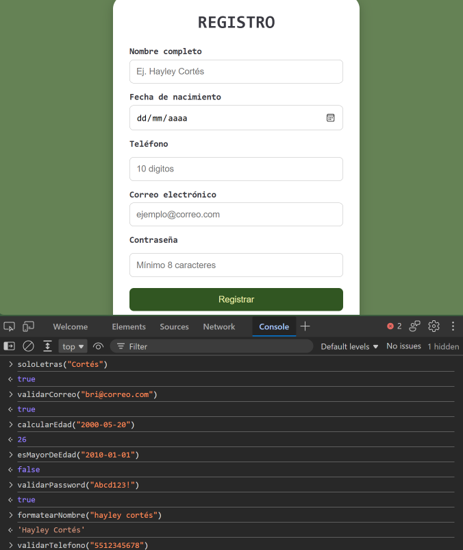
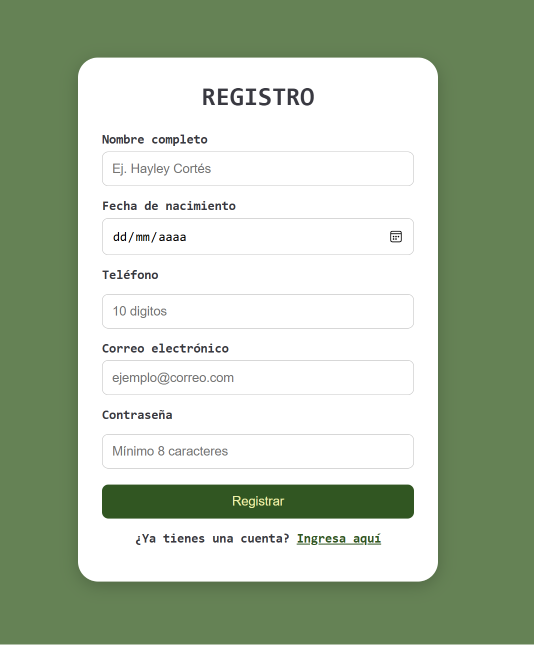
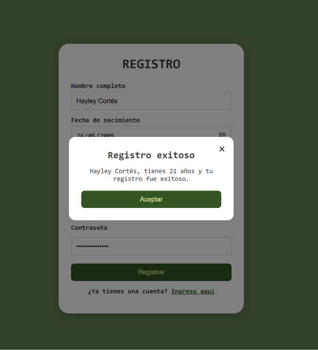
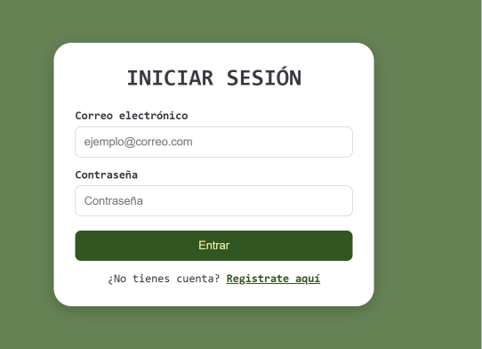
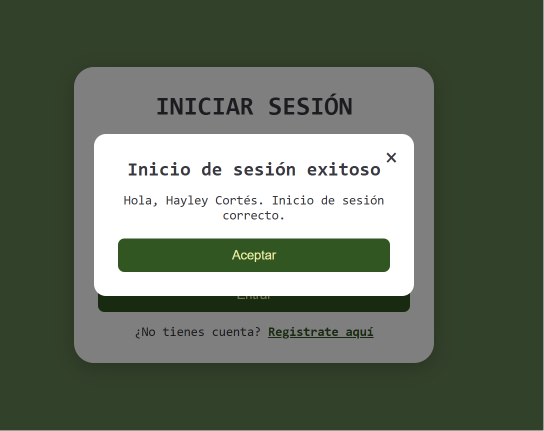

## Portada
Hayley Cortés — Instituto Tecnológico de Oaxaca, Programación Web.

**utileria.js** es una librería de JavaScript (sin frameworks) que resuelve el problema de **validar datos de formularios en español**: correos, nombres, teléfonos, contraseñas seguras y cálculo de edad. En vez de escribir la misma expresión regular en cada proyecto, se incluye un script y se llama a la función.

**GitPage:** https://bricortestec.github.io/Actividad2-PW/

## Instalación

Hacer referencia de  `js/utileria.js` al proyecto e incluirlo en HTML antes del propio script:

```html
<script src="js/utileria.js" defer></script>
<script src="js/tu-script.js" defer></script>
```

## Uso

### Funciones obligatorias

```js
validarCorreo("bri@correo.com");        // true
soloLetras("Cortés");                   // true
validarLongitud("12345678", 8);         // true
calcularEdad("2000-05-20");             // edad en años (entero)
esMayorDeEdad("2010-01-01");            // false
validarPassword("Abcd123!");            // true
```

### Funciones propias

```js
// Da formato a un nombre: primera letra de cada palabra en mayúscula
formatearNombre("hayley cortés");   // "Hayley Cortés"

// Valida que un teléfono tenga exactamente 10 dígitos
validarTelefono("5512345678");      // true
```

### Ejemplo real: usada dentro de un formulario

```js
if (!validarCorreo(correo)) {
    mensaje.textContent = "El correo electrónico no tiene un formato válido";
    return;
}

if (!esMayorDeEdad(fechaNacimiento)) {
    mensaje.textContent = "Debes ser mayor de edad para registrarte.";
    return;
}
```

### Integración en el proyecto

- **`index.html`** — formulario de registro. Valida nombre, fecha de nacimiento, teléfono, correo y contraseña, y muestra la edad calculada en un modal al registrarse con éxito.
- **`login.html`** — inicio de sesión. Valida correo y contraseña con la librería, y compara contra los datos guardados en `localStorage` durante el registro.

## Capturas de pantalla

Consola mostrando el resultado de cada función:



### Registro

Formulario de registro:



Modal con la edad calculada al registrarse con éxito:



### Login

Formulario de inicio de sesión:



Modal al iniciar sesión con éxito:



## Video
https://youtu.be/w3OkII7s_68
